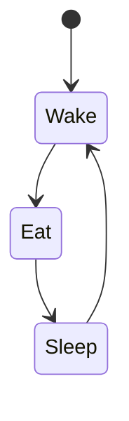

Just created the library [`@southball/remark-mermaid`](https://www.npmjs.com/package/@southball/remark-mermaid) for using [mermaid diagrams](https://mermaid.js.org/) in [Remark](https://remark.js.org/). Multiple themes on the same page is also supported through configuration and re-prefixing of referenced classes.

An example is shown below:

