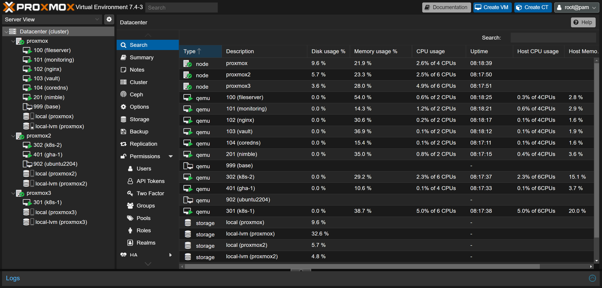

# About Proxmox

> Proxmox VE is a complete open-source platform for enterprise virtualization. With the built-in web interface you can easily manage VMs and containers, software-defined storage and networking, high-availability clustering, and multiple out-of-the-box tools on a single solution. [^proxmox]

I have been using [Proxmox](https://www.proxmox.com/en/) as the virtualization solution for managing my servers. Proxmox provide a convenient web interface, which allow convenient access to powerful features like [KVM live migration](https://www.linux-kvm.org/page/Migration).



# About cloud-init

> Cloud-init is the industry standard multi-distribution method for cross-platform cloud instance initialisation. It is supported across all major public cloud providers, provisioning systems for private cloud infrastructure, and bare-metal installations. [^cloud-init]

Using cloud-init, it is possible to create users, configure networking, set SSH key, etc. As the number of virtual machine grows, it becomes more and more annoying to configure each virtual machine manually. Cloud-init provides a solution to the problem, by providing a standard solution for initializing VM instances. Proxmox supports cloud-init, so in this article I will discuss how it can be used.

# Using cloud-init with Proxmox

First of all, prepare an instance with the desired operating system normally. It is recommended to start with a small disk size like 8 GB, since it can be expanded later easily, and transferring the disk when performing live migration requires transferring the whole disk, regardless of how much disk space is actually used.

After that, run the following command:

```sh
cloud-init clean --logs --machine-id
```

# Expanding the hard drive after cloning

1. Resize the disk from Proxmox web interface.
2. Login to the instance.
3. Use `pvdisplay` to find the physical volume.
4. If the physical volume is at `/dev/sda3`, run `growpart /dev/sda 3`
5. Run `lvdisplay` to see the logical volume name.
6. If the logical volume is at `/dev/ubuntu-vg/ubuntu-lv`, run `lvextend -l +100%FREE /dev/ubuntu-vg/ubuntu-lv`.
7. Run `resize2fs /dev/ubuntu-vg/ubuntu-lv`.
8. Run `df -h` to check the volume has been successfully expanded.

[^proxmox]: https://www.proxmox.com/en/
[^cloud-init]: https://cloudinit.readthedocs.io/en/latest/
