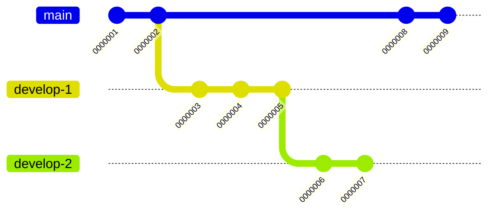
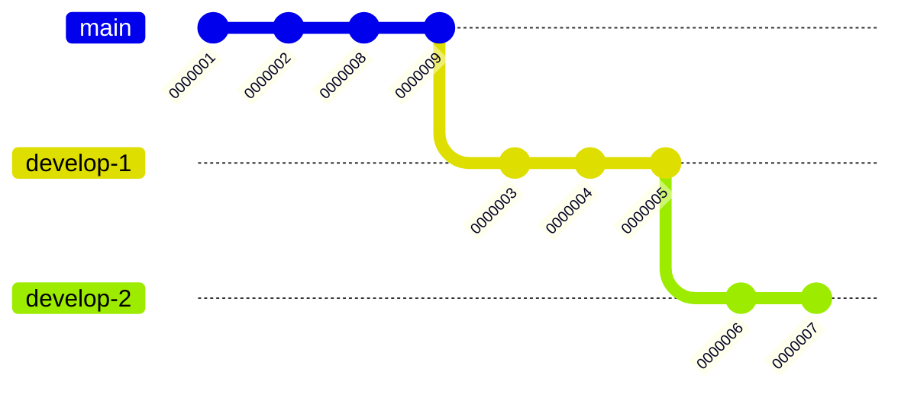
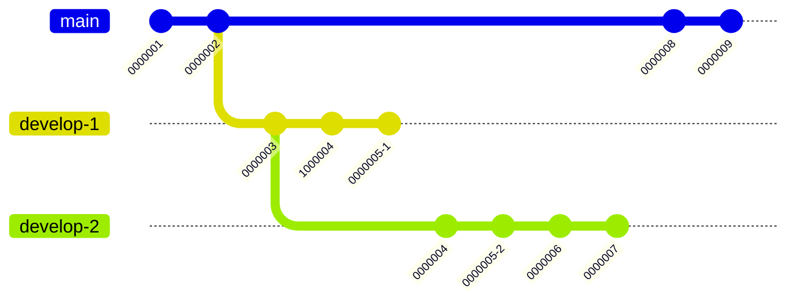
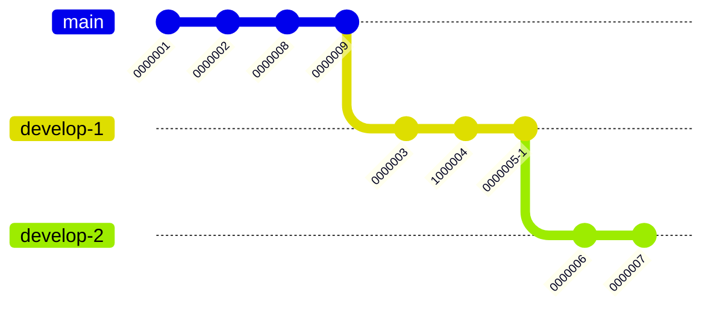

# Why this article?

There may be many good articles about Git rebase, but I failed to find one that covers everything I want it to. Plus I need a draft for the Japanese version of this article, so here it is.

# Forenote

I am not 100% sure that all information is accurate. This article is mostly based on how I commonly use this feature of Git, and I try to ensure that the information accurate, but there are no guarantees.

# Features branches

This introduction assumes the use of feature braanches, where force-push is acceptable.

To update a local feature branch that has been affected by force-push, try

```sh
$ git pull --rebase origin $BRANCH
```

If it is alright to discard local changes on the branch, try

```sh
$ git reset --hard origin/$BRANCH
```

# What is Git rebase?


when we run `git rebase main` on branch `develop`, we get


# What is Git interactive rebase?

When we run `git rebase -i main` instead, we get `git` like below:

```git-rebase
pick 0000003 Commit message for commit 3
pick 0000004 Commit message for commit 4
pick 0000005 Commit message for commit 5
```

We can edit this file, save and quit the editor. Then the rebase will begin.

## Basic commands: continue and abort

`git rebase --continue` allows one to continue a rebase, and `git rebase --abort` allows one to abort one.

## Squash

If we edit the rebase todo to as follows,

```git-rebase
pick 0000003 Commit message for commit 3
squash 0000004 Commit message for commit 4
pick 0000005 Commit message for commit 5
```

Then we will get two commits: one commit consisting of changes from `0000003` and `0000004`, and another commit consisting of changes from `0000005`. You will also be prompted to edit the commit message for the commit consisting of both changes from `0000003` and `0000004`.


## Edit

If we edit the rebase todo to as follows,

```git-rebase
pick 0000003 Commit message for commit 3
edit 0000004 Commit message for commit 4
pick 0000005 Commit message for commit 5
```

Then the rebase will pause after the commit `0000003` and `0000004`. The state will be as shown below (assuming that no conflicts occur during the rebase of `0000003` and `0000004`):


Git commands can then be issued, including `git commit --amend` after editing some files. Run `git rebase --continue` to continue the rebase.

## Drop

If we edit the rebase todo to as follows,

```git-rebase
pick 0000003 Commit message for commit 3
drop 0000004 Commit message for commit 4
pick 0000005 Commit message for commit 5
```

then when the reabse completes the history will be as follows (notice that the commit `0000004` is gone):


## Rearranging commits

If we edit the rebase todo to as follows,

```git-rebase
pick 0000005 Commit message for commit 5
pick 0000004 Commit message for commit 4
pick 0000003 Commit message for commit 3
```

then when the reabse completes the history will be as follows (notice the order of the commits):


# Common patterns

## Catching up with the main branch

`git checkout feature` followed by `git rebase main` should do most of the time.

## Catching up with the main branch (with stacked PRs)



The following instructions should update all branch

```sh
$ git checkout main
$ git checkout develop-1
$ git rebase -
$ git checkout develop-2
$ git rebase -
```

The final result will be as follows:



## Updating stacked PRs with changed commits

Here commit `1000004` is the changed version of commit `0000004`. `0000005-1` and `0000005-2` are the same commits.



Run the commands as follows:

```sh
$ git checkout main
$ git checkout develop-1
$ git rebase main
$ git checkout develop-2
$ git rebase -i develop-1

drop 0000004 Commit 4, revision 1
drop 0000005-2 Commit 5
pick 0000006 Commit 6
pick 0000007 Commit 7
```

The result will be as follows:


